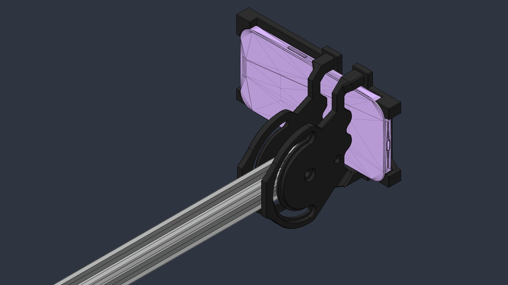
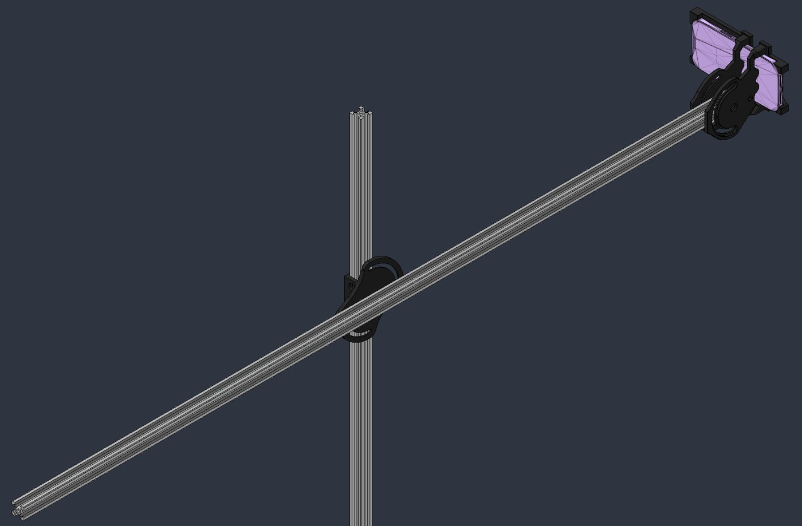
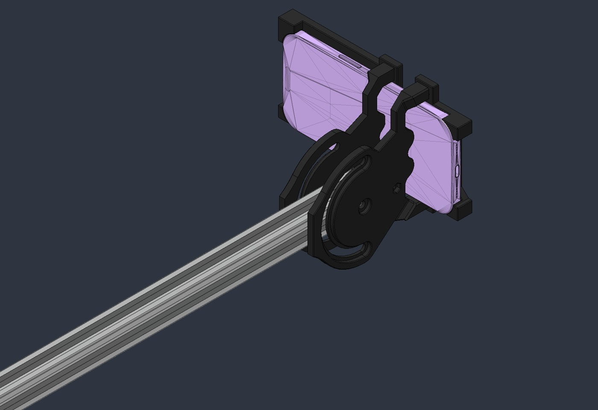
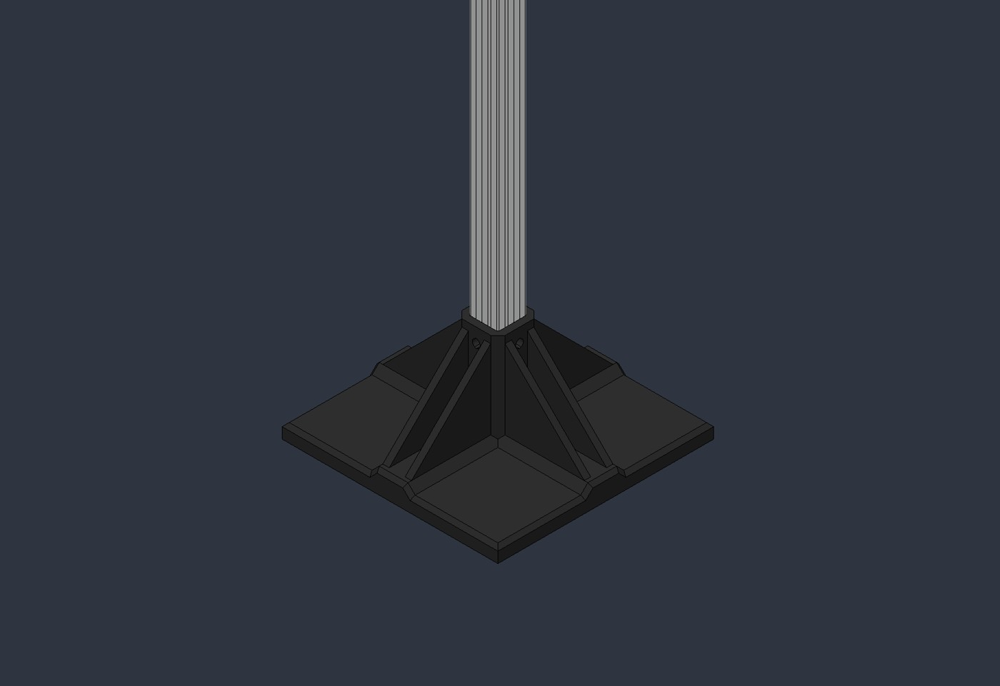
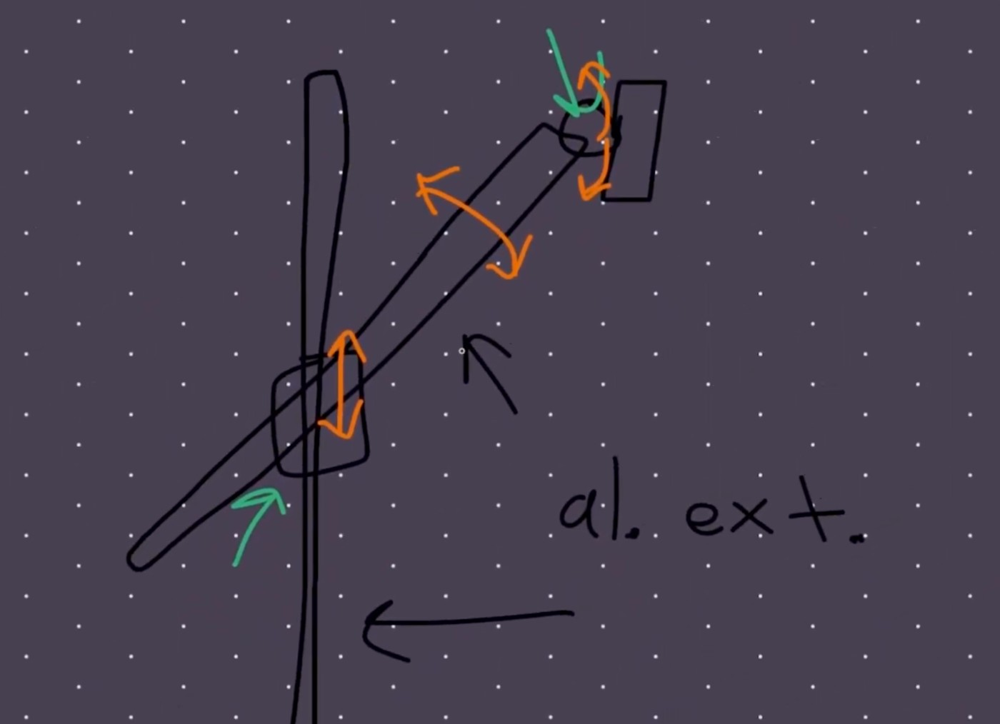
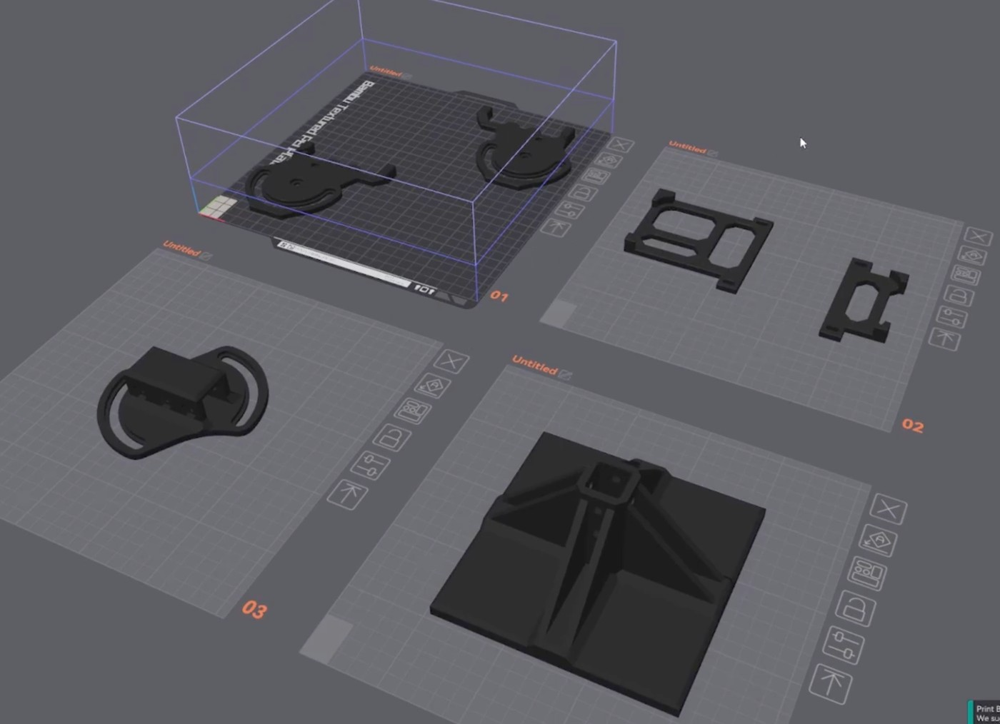
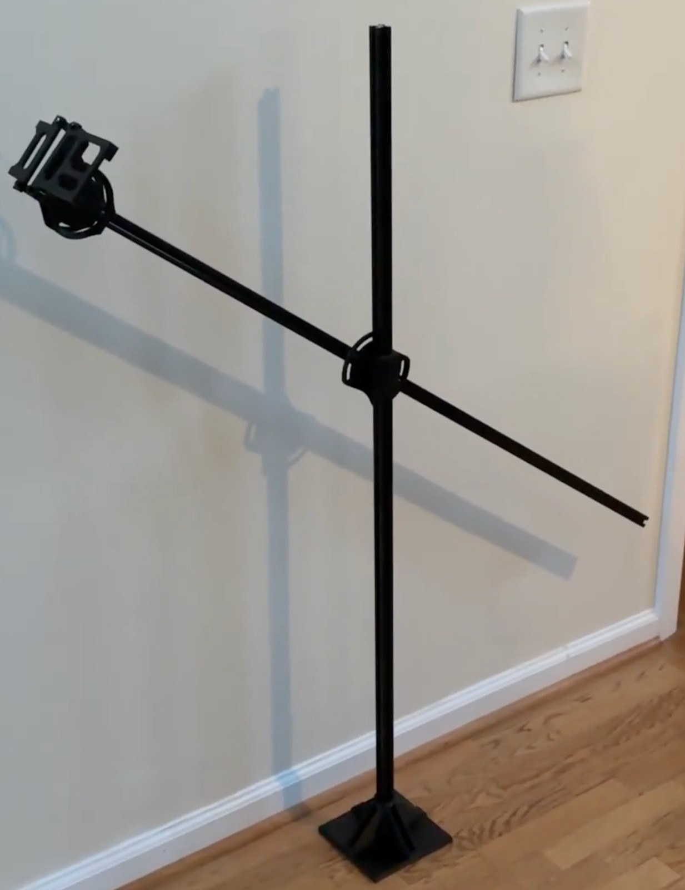

# Phone Mount

An adjustable iPhone filming mount built from aluminum extrusion and custom 3D-printed fixtures. Designed and built by **Ethan Mahajan** to document engineering projects without a dedicated camera rig.

**Status:** Working physical prototype. CAD and printable files are pending upload.

[Watch the build video](https://www.youtube.com/watch?v=NBOV5k6CR7c) · [Engineering portfolio](https://ethanmahajan.github.io)

## Overview

The mount combines reusable extrusion with printed joints and a phone-retaining assembly. It provides vertical adjustment, arm rotation, and phone orientation adjustment; screws lock the joints after positioning. The first set of printed parts assembled into a usable mount and was retained for final filming use.

The estimated project cost was approximately **$18 including extrusion**, or **$4 excluding extrusion**, as reported in the build video. These are estimates for the original build, rather than a current purchasing quote or complete priced bill of materials.

## Design

### Structure and adjustment

Aluminum extrusion forms the upright and filming arm. A braced printed base supports the upright, while custom connectors provide the height and angular adjustments. The design prioritizes reusable stock material, straightforward fabrication, and a small number of custom components.

### Phone holder and hardware

Printed retaining fixtures hold the phone and connect it to the adjustable arm. M4 screws and heat-set inserts secure the retaining pieces. M5 screws attach the fixtures to the extrusion. The original design uses 5.5 mm clearance holes for M5 fasteners.

The holder was designed around the phone used in the original build. Compatibility with other phones, cases, and camera layouts has not been established; check the dimensions in CAD before printing.

### Base and print-oriented geometry

The base uses bracing to support the vertical extrusion. Chamfers and inclined internal surfaces were incorporated to make the fixtures practical to manufacture with FDM printing. The design also uses screw-tightened connections so the mount can be repositioned and assembled without specialized fabrication processes.

## Design process

The concept began with the required motions: translating the arm vertically, rotating the arm, and adjusting the phone orientation while keeping the base fixed. The fixtures and assembly were modeled in **Fusion 360** and prepared for printing in **OrcaSlicer**.

## Fabrication

The original fixtures were printed in **ABS**. Parts were arranged for individual printing, and a Hilbert-curve infill pattern was selected based on prior experience with ABS warping. All parts printed successfully on the first attempt.

The precise layer height, wall count, infill density, temperatures, extrusion lengths, and fastener quantities are not yet documented. Confirm these against the uploaded design files before reproducing the build. ABS was the material used for this prototype; other materials have not been validated here.

## Components

| Component                                      | Purpose                         | Documented details                               |
| ---------------------------------------------- | ------------------------------- | ------------------------------------------------ |
| Aluminum extrusion                             | Upright and adjustable arm      | Exact profile and cut lengths pending CAD upload |
| Printed base                                   | Supports the upright            | ABS prototype                                    |
| Printed connecting fixtures                    | Height and arm-angle adjustment | Screw-tightened joints                           |
| Printed phone-retaining fixtures               | Hold and orient the phone       | M4 screws and heat-set inserts                   |
| M5 fasteners and compatible extrusion hardware | Attach fixtures to extrusion    | Lengths and quantities to be confirmed           |
| M4 fasteners and heat-set inserts              | Secure retaining pieces         | Lengths and quantities to be confirmed           |

## Assembly outline

1. Review the CAD for phone clearance, extrusion fit, and access to the fastening points.
2. Print the base, connectors, and phone-retaining fixtures.
3. Install the heat-set inserts used by the retaining pieces.
4. Attach the upright to the base and install the arm connector and arm extrusion.
5. Assemble the phone holder, position the joints, and tighten the fasteners.
6. Check phone retention and balance in the intended filming position before use.

This is an overview of the prototype assembly, not a dimensioned assembly manual. Detailed part names and hardware quantities can be added when the CAD is uploaded.

## Prototype and results

The first printed prototype was good enough for filming with an iPhone. One assembly issue was an omitted access hole that made an extrusion-mounting screw difficult to reach. It was worked around during assembly and remains a clear improvement for a future revision.

The holder has some play, and touching the base introduces visible shake. The mount is therefore best suited to stationary recording once positioned. Further work would focus on holder stiffness, base stability, and easier fastener access. No load-rating or quantitative vibration testing has been completed.

## Files

| Folder          | Intended contents                                  |
| --------------- | -------------------------------------------------- |
| `cad/`          | Native Fusion 360 source files (`.f3d`)  |
| `exports/step/` | STEP assembly and component exports                |
| `exports/stl/`  | Printable STL files                                |
| `docs/images/`  | Concept, CAD, slicing, and prototype documentation |

To upload files through GitHub, open the appropriate folder, select **Add file → Upload files**, and commit the upload. Use descriptive component names and export meshes in millimeters. Keep the native source alongside STEP exports so the design is both editable and accessible in other CAD tools.

## Video

GitHub READMEs do not play embedded YouTube iframes. The linked preview below opens the full build video.

| Time | Topic                         |
| ---- | ----------------------------- |
| 0:36 | Design overview               |
| 1:31 | CAD overview                  |
| 4:25 | Slicing                       |
| 5:43 | Assembly showcase and results |
